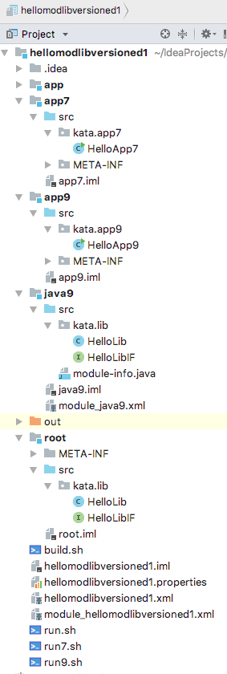
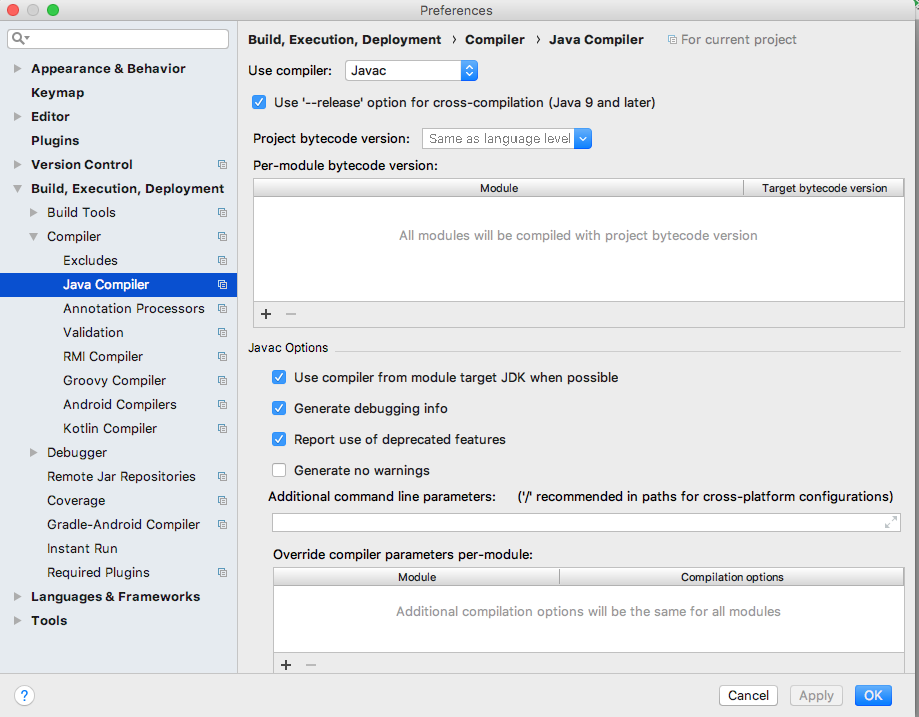
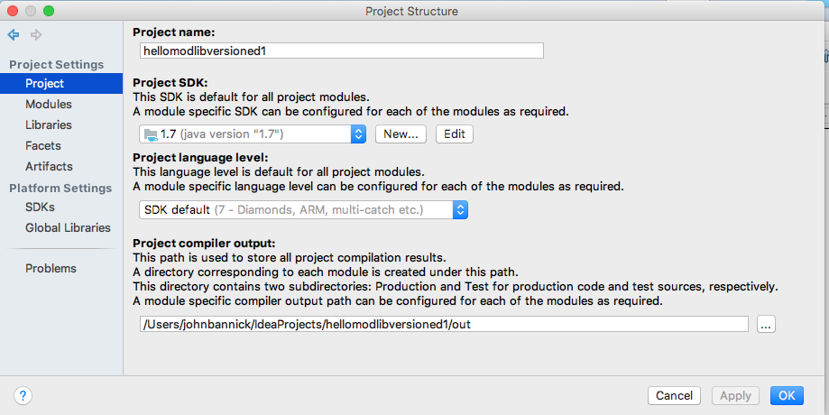
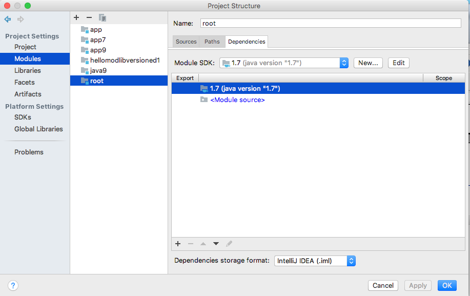
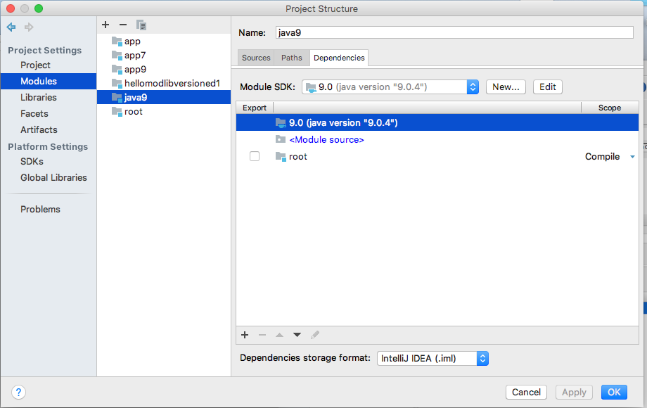
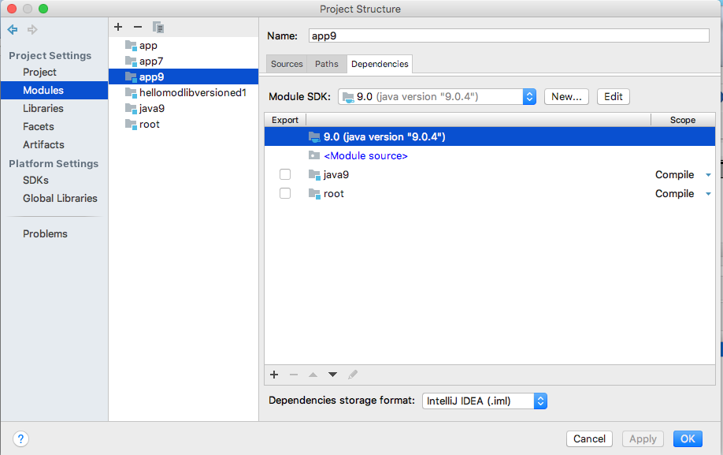

This describes how to build this Versioned library using IntelliJ.

It's based on:
https://blog.jetbrains.com/idea/2017/10/creating-multi-release-jar-files-in-intellij-idea/

The key operational elements are:

- The term "module" is overloaded here
    - IntelliJ modules are separately executable collections of code
    - Java modules are collections of Java packages
- One IntelliJ module for each of the 4 executable elements
- JDK settings for:
    - Your IntelliJ installation
    - The project
    - Each of the 4 executable elements
    
The rest of this description consists of pictures.

###Project Structure:

#####JDK Settings:

#######IntelliJ Java Compiler

#######Library Project JDK

#######Library Root Version JDK

#######Library Java 9 Version JDK

#######Java 7 App JDK

#######Java 9 App JDK

